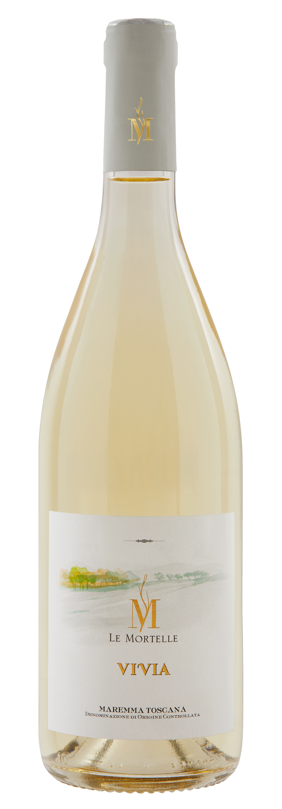
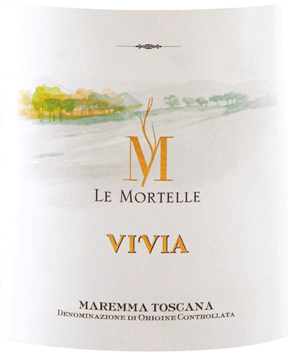
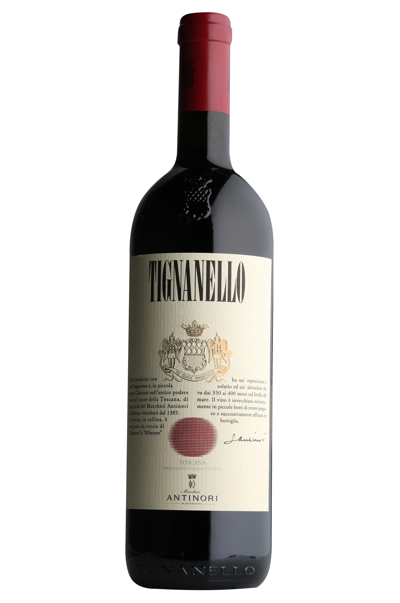
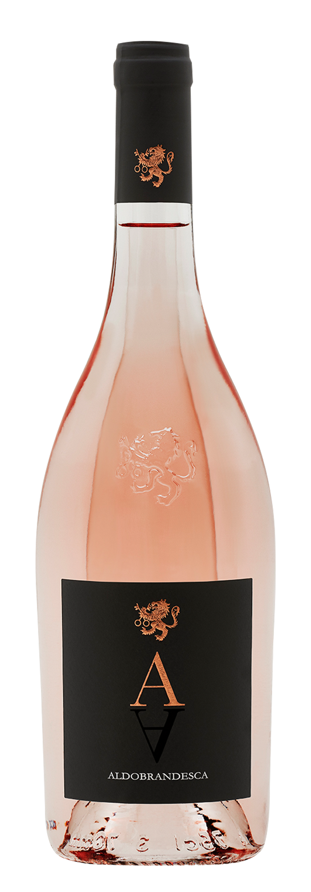

Tuscany, such an idyllic region of Italy with so much to offer it’s not a surprise that it is in [the top 30 most visited regions in the EU](http://www.italian-lawyer.eu/veneto-tourism). It has it all, fabulous fashion, delicious food, art, architecture, breathtaking landscapes, beautiful beaches and much much more. It also produces some of the finest wines in the world. [With nearly 2.78 million hectoliters of wine produced in 2014 ](https://daily.sevenfifty.com/regions/tuscany/#:~:text=Nearly%20two%2Dthirds%20of%20Tuscany's,2.78%20million%20hectoliters%20of%20wine)Tuscany has become one of Italy's largest wine producing regions.

# **[Antinori Wine](https://www.antinori.it/en/0)**

The Antinori Winery is located twenty-five minutes south of Florence and[ with around 20 million bottles of wine produced annually across one hundred and fifty labels](https://www.wine-searcher.com/merchant/27479#:~:text=Antinori%20is%20a%20Tuscany%2Dbased,produced%20annually%20across%20150%20labels) the vineyard has created quite the reputation for itself.

Let's start with a white wine, Vivia. Using a mixture of three grapes Vermentino, Ansonica and Viognier the wine has a peachy taste to it with hints of citrusy lemon. The label on the bottle consists of many different fonts some of which are unknown, they do however have one feature that is consistent throughout the font choices this is the use of serifs. The large M in the centre of the label consists of high contrast and long thin serifts, the shape of this letter with the vine growing off the inside of the M has been created for the bottle meaning its one of a kind, and the font itself is hard to find. Having said this the word “Le Mortelle” below has been written in what I believe to be the font Serlio LT, the font consists of a low contrast and slight serifs but you have to focus on the word in order to see them. Moving on the title of the wine itself “Vivia”, the letters have been written in a very different looking font, which once again is hard to identify thus making the word and bottle unique.

Next up red wine. Tignanello is a lovely bold and dry wine, it tastes earthy with hits of oak, chocolate and blackfruit. The wine itself has proved to be extremely popular and pairs well with beef, veal and lamb. The title of the wine is written in a font similar to Bordeaux Std Bold, the word looks as though it has been stretched upwards and squeezed inwards. The serifs are thin and the contrast is extreme. In the second industrial revolution font changed due to advertising on posters and billboards meaning words where made taller in order to stand out, which is the impression I get from this font it's almost as if its trying to sell itself to you.

\
To finish off let's have a look at an Antinori rosé. This wine is full of flavour, hints of red fruits mix with citrusy grapefruit. The wine has one single letter “A” this is to represent the family's estates initials as well as the grapes used to create the wine. This wine looks enchanting and so far apart from other wines. In terms of Typography this wine only has one font, but the font that has been chosen is extremely effective and has a huge impact on the bottle alone. The font used is akin to ITC Bodoni Seventytwo Pro Book, the font has a extreme contrast and thin serifs giving it a classy, elegant feel which reflects the wine itself.