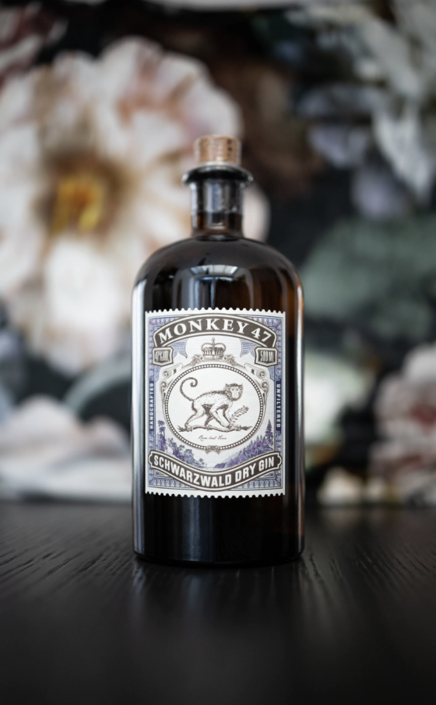

*With the popularity of gin forever rising the need for eye catching bottles and labels is forever increasing. How does a bottle of gin stand out from behind the bar?* 

There’s something special about a Gin and Tonic. It's perfectly suited to every occasion. Suns out? Have a cool, crisp, G&T. Long cold winters day, sit by the fire and pour yourself a relaxing G&T. Long day at the office? Go on.....reward yourself with a G&T!  That zesty gin balanced out perfectly with a bitter tonic water is the answer to almost everything! No wonder it was first used [as a medicine back in 1600s ](https://www.themanual.com/food-and-drink/a-brief-history-of-gin/) to treat the people of Holland that suffered with dyspepsia and gout.

Over the years gin and tonic has become increasingly popular, in [2017 a YouGov poll found gin to be the most popular spirit in the UK](**<https://www.theguardian.com/money/2017/dec/16/britons-set-new-gin-record-after-buying-47m-bottles-this-year-supermarkets-christmas>**). The market for gin is constantly growing and as a result of this there has been an increase in the number of different gins, thus creating a battle within the gin market. As the competition has grown the design of the gin bottle has become increasingly important. Let's face it most of us Brits love to put a gin bottle on display, whether it’s on display at home in your drinks cabinet on your highest shelf an eye catching gin bottle has become a decorative piece. 

\
Above is a photo of the classic Gordons gin bottle. The branding on the bottle gives off the impression of royalty with the royal seal of approval on the front letting us all know that the Queen likes a cheeky Gin and Tonic too. The word that stands out the most is the brand name Gordons, although I could not find the exact font it is somewhat similar to [American Oak Script created by Ian Barnard](https://www.designcuts.com/product/american-oak-4-font-set/). The high contrast within the font creates a sort of elegant feel to it. By using Italics Gordons have put emphasis on their brand name. So when you're standing at a bar looking up at the hundreds of gin bottles on display you'll spot Gordons name and ask for a double!

Moving on to a slightly more expensive gin Monkey 47. You can find this gin at Waitrose for around forty-six pounds for 500ml. I feel as though this bottle of gin really does stand out from the rest. I love the way that there's this traveling theme going on with the front label. The monkey connotes thoughts of hot countries outside of Europe such as India, the label is shaped to look like a stamp on a postcard implying its come from afar to be with us, making it important. Similar to that on a stamp the typography on the label is simple , which makes it stand out. The font is extremely similar (if not the same) to Garam Simon SB Extra Bold, just like Gordons typography the text has a high contrast creating a elegant feel to it. The font also looks classic with its use of serifs and make us feel the gin has been around for a long time.

Moving on to one of my personal favourites, Silent Pool. For thirty nine pounds you can bring home one of these beautiful bottles from Waitrose. Silent Pool is perfect for your at home bar. The bright turquoise bottle implies ideals of Tiffanys, covered with luxurious gold patterns. The bright shades attract attention making us want to look at the bottle in greater depth. The font is simple, clean and clear, by using a San Serif typeface the text looks modern and approachable. I believe Silent Pool is written in the Sweet Sans Bold Small Caps. The text is written in Caps Lock making the brand name seem important, I have however noticed when zooming in on the font you can see the letters at the beginning of each word have been enlarged. This is unusual as typically when words are written in caps locks all the letters in the text would be equal in size. Underneath the brand name the words “Intricately Realised Gin” look as though they are in the same font but not in bold, this also helps to make Silent Pool stand out in comparison to the rest of the text.