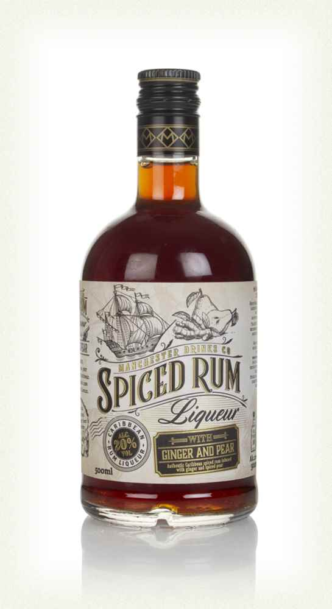
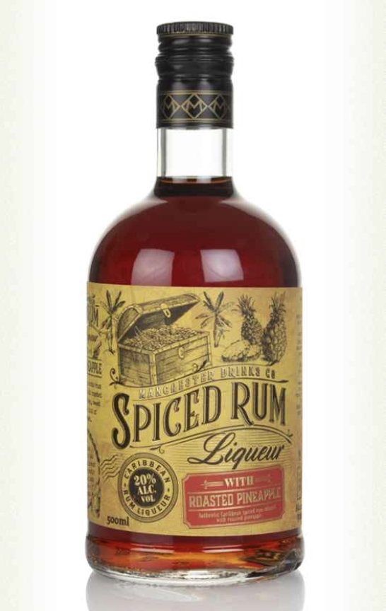
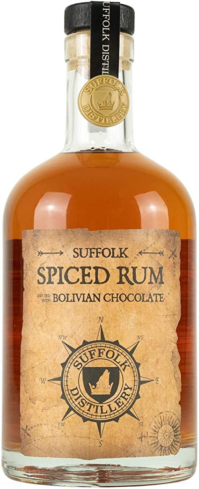
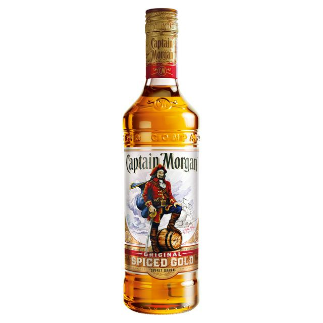

*Is the design of rum affected by its pirate history?* 

Pirates drank any liquor they could get their hands on, Rum however became their signature drink due to the endless amount of large barrels they would find on the ships they hijacked. The shire lack of safe drinking water is what fueled the pirates need for spirits (by mixing the unclean water with spirits the water became safe to drink).For this reason as well as its ability to keep crew members happy and boost confidence, Pirates managed to get through an awful lot of rum. One hundred and eighty years later the history of rum still has an affect on the way in which well known companies design there's bottles. 

**[Spiced Rum ](https://www.masterofmalt.com/liqueurs/manchester-drinks-co/manchester-drinks-co-roasted-pineapple-rum-liqueurs/)**

Both of these bottles have subtle hints to rums pirate history. The first bottle conveys more subtle ideologies of pirates with the ship on the top of the label, the ship could belong to pirates, or it could just show the way in which rum was transported from the west indies to the rest of the world. The second bottle shows stronger references to pirates with a treasure chest on the top left of the bottle. The font used is consistent throughout the brand when representing the name “Spiced Rum”.  It’s unusual to see that the two words aren't horizontal but in fact have a slight curve to them, almost as if they are part of a wave which ties into the sea, ship, pirate theme. The text has been made to appear 3D with the slight shadow behind the text, this highlights the slightly odd swirls coming off the top of the S, C and E. The font used for liquor written underneath spiced rum adds history and feels old as if it's been written with a fancy feather ink pen. 

**[Suffolk Spiced Rum ](https://www.suffolkdistillery.co.uk/product/spiced-rum/)**

The label is simple but effective. It looks like it's been dipped in tea and then had its sides gently brushed by a flame to make them look like they've worn away over time, it's got that “old look” we all know and love. It doesn't take a genius to know suffolk distillery has gone for a map theme with their label, I particularly like how distrillys name is part of the compass, it feels as though we are about to take part in this great adventure. I don't know how great your eyesight is but if you look close enough you may notice two little “X” (one on the top right and one on the bottom left). Although the tales of pirates going around hiding treasure in chests on remote islands and X marks the spot isn't completely true, there were a few real life stories like [Captain William Kidd](https://www.history.com/news/did-pirates-really-bury-their-treasure) . Which once again proves that this is yet another bottle of rum designed to show off rum's pirate history. 

The typography includes a serif typeface, it matches with the theme of the label in that it has been made to look as though the edges have slightly worn away over time. In total the font looks mature and aged which links to its overriding theme of a pirates treasure map. 

[Captain Morgan](https://www.sainsburys.co.uk/gol-ui/product/rum/captain-morgans-spiced-gold-70cl) 

I don't think I need to explain how this rum has a buccaneer theme to it. Although the theme of all of these rums is corresponding the typography on is incompatible. Captain Morgan appears to have been written by someone equipped with an expensive thick ink pen and exceptional, unique handwriting. The font chosen makes the bottle feel of importance as well as feeling personal at the same time.