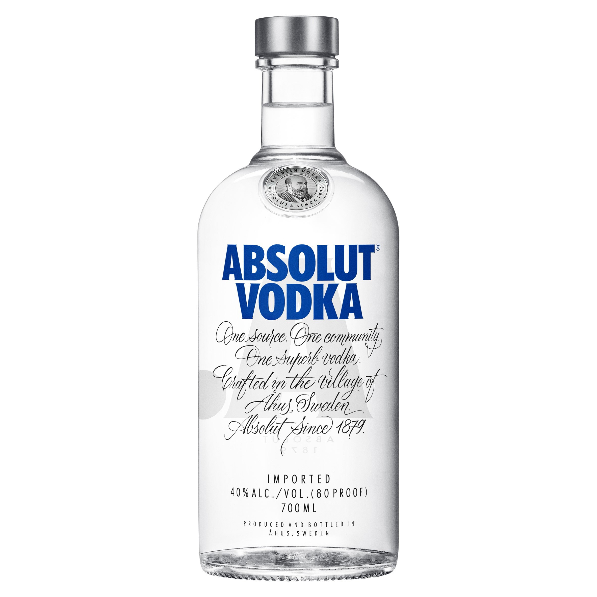
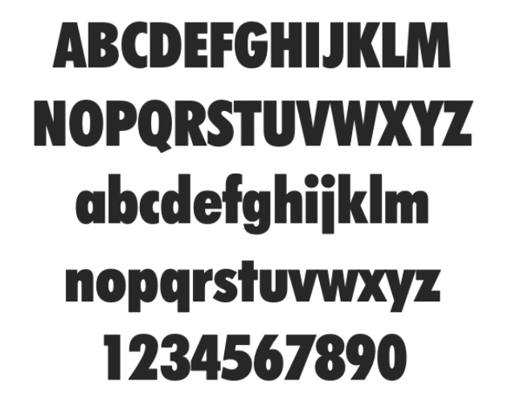
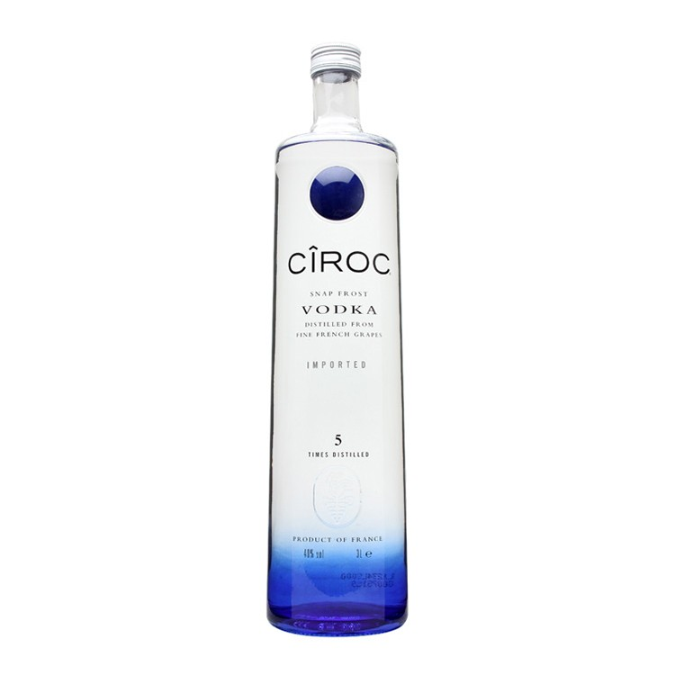
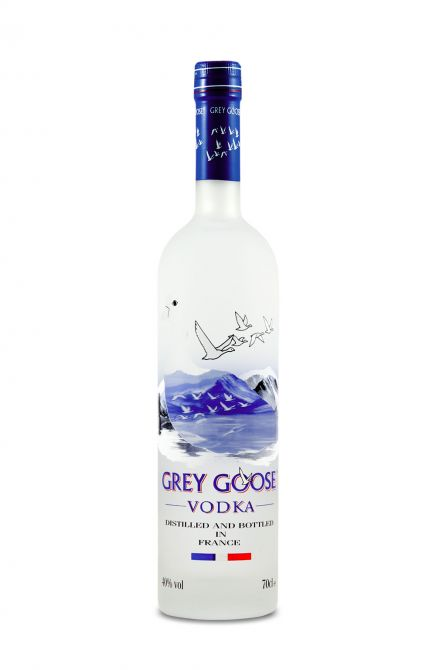

*The [alcoholic drink made from potatoes ](<https://economictimes.indiatimes.com/industry/cons-products/liquor/10-alcoholic-drinks-and-their-magic-ingredients/whiskey/slideshow/60171876.cms>)has proved itself to be popular over the years, particularly in nightclubs. But how do the most prominent vodka bands promote themselves on their bottles?* 

 

**Absolut Vodka** 

Due to the shortage of colour available our eyes instantly lock onto the dark blue letters on an Absolut vodka bottle. The Geometric san-serif typeface used for this text makes the bottle look modern and elegant. I can not be certain however I believe the font used is “Futura Extra Bold Condensed”. 

Futura has been known for being clean, versatile and of high-quality. Its even been seen with brands such as [Nike, Vanity Fair, Ikea, A political party campaigning against Hitler and on the moon! ](https://www.digitalartsonline.co.uk/features/typography/heres-everything-you-should-know-about-futura-on-its-90th-anniversary/#1)Pretty impressive if you ask me. By using Futura, and then making it extra bold, with the dark blue against a white backdrop, Absolut Vodka has created quite the dramatic look for itself. 

Underneath this text is what looks like a mini paragraph of writing, I believe that this is the script font [“ITC Edwardian Script”](<https://www.linotype.com/634/itc-edwardian-script-family.html
>), which was created in 1994 and influenced by the look of writing with a steel pointed pen. By choosing to use a script typeface Absoulut have created a more personal feel to their bottle but have also kept it elegant. 

**CIROC** 

Yet another vodka bottle with a color scheme of blue, white and black. The brand's name Ciroc looks modern and minimalist.In contrast to Absolute Vodica’s bold text Ciroc use thin text but still stands out from the writing around it. I am of the opinion that Ciroc has been written in the font Termina Regular, this font stands out from your average geometric san-serif due to its generously wide letter forms and puts a modern spin on wide geometric, grotesque style. 

**Grey Goose** 

This French Vodka was created by Sidney Frank in the 1990s and sold to Baccardii in 2004. Like the others it consists of a similar color scheme however gray goose has more to offer in terms of image. The two above are rather plain in comparison. The font used diffrese as well as although the serifs have been kept to a minimail this is still a serifs typeface as opposed to the two above which are both san-serifs. According to [“Font Meme”  ](<https://fontmeme.com/grey-goose-font/>)gray goose uses Albertus Roman, which is a glyphic serif display. They have paired this font with a white outline as a shadow in order to make the words 3D, which helps to draw attention from the imagery above to the company's name.

Fun Fact: Albertus is that it was created by Berthold Wolpe in order to resemble letters carved in Bronze.  

**SIDE NOTE:**  Obviously these three bottles are not an accurate representation of all vodka bottles worldwide, however there are a large number of bottles that stick the same blue colour scheme as the bottles above. This could just be because it looks appealing in contrast to the color of the liquor inside these bottles, or it could be due to the meaning behind Vodka. The name Vodka comes from the russian word for water “Voda”, and water is normally associated with the colour blue. Has this got anything to do with the bottle design? I'm not sure.