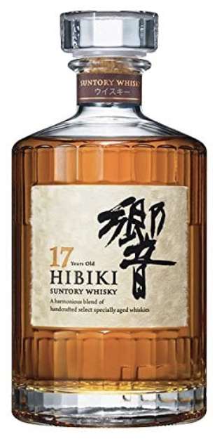
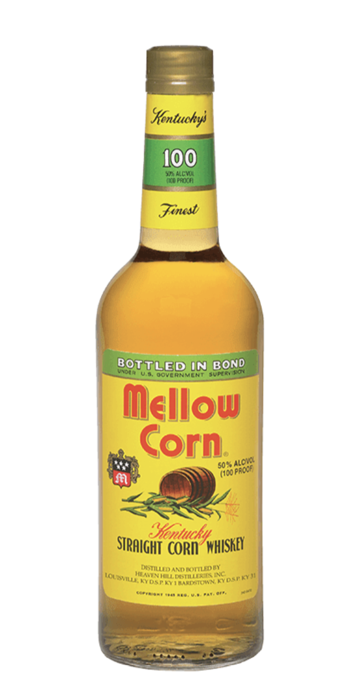
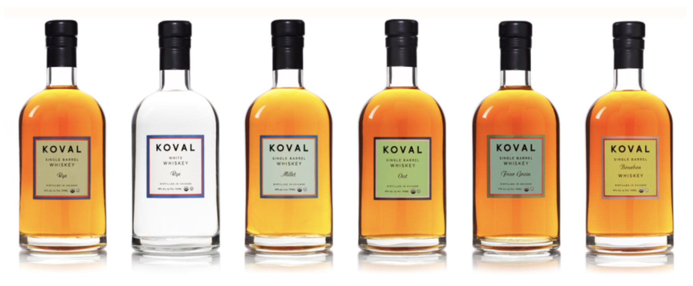
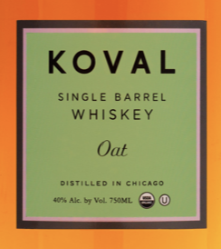

\
Due to its high percentage whiskey tends to be a liquor that hangs around on the shelf as a decoration until the cigars come out. Therefore the design of the bottle and label is crucial in keeping the brand alive (nobody wants an ugly whiskey bottle on display) . No bottle is the same; they all seem to have their own unique design/ style. How do these bottles stand out from one another and what variety of fonts help them do so?

**[Hibiki : £66](https://www.waitrose.com/ecom/products/hibiki-suntory-whisky-japanese-harmony/409868-457046-457047)**

Not an extremely well known Whisky but not unheard of either. Launched in 1989 It was realised in time to commemorate the 90th anniversary of the japanese multinational brewing and distilling company group, Suntory. This Bottle is classic in shape but stands out due to its unique label. It looks like one of my old history projects when in order to get an ‘old effect’ we smothered paper in tea water. This combined with the strange shape filled with something in japanese that us Brits will never be able to read, makes for a striking label. 

At first glance, it's not hard to suss out where this bottle has come from. The writing on the right hand side is a key symbol in showing off its japanese heritage. You seem to get the impression that the writing has been handwritten on to the bottle using some sort of black fountain pen with a bold nib. Making not only feel as though its been made for you but it also helps to promote ideals of japan as japanisses fountain pens are recognised worldwide  . [“Japanese fountain pens have become internationally known for combining style, value, and exceptional writing qualities”   - ](https://www.nibs.com/content/japanese-fountain-pens#:~:text=Japanese%20fountain%20pens%20have%20become,value%2C%20and%20exceptional%20writing%20qualities.&text=With%20a%20centuries%2Dlong%20tradition,element%20of%20any%20fountain%20pen.)John Mottishaw's

When looking at the main word “HIBIKI” the font has small pointed serifs which is why I believe it belongs to Schneidler Initials font-family. Schneidler Initials was created by Friedrich Hermann Ernst Schneidler. F H Ernst Schneidler was born in Berlin in 1882, he worked as a Type Designer, Publisher and Calligrapher. This font was created in 1957 to complement his font named Schneidler Old Style. This font is known for its beauty and elegance which suits the whisky bottle and brand wonderfully.

**[Mellow Yellow: £31.10](https://www.masterofmalt.com/whiskies/mellow-corn/mellow-corn-whisky/?utm_content=mellow-corn/mellow-corn-whisky&currencyCode=GBP&utm_source=database&utm_medium=base&utm_campaign=mom_base_1&gclid=Cj0KCQiAnb79BRDgARIsAOVbhRqQbo9EVbXxN2_CpxogfMqWSXfP1lFwwCibYnDj3pbplk8kZMGEXBkaAlkpEALw_wcB)**

Corn may sound like a rather odd ingredient to have 90 % of your whiskey made out of however, this drink has proved to be rather popular throughout the last 80 odd years. The bottle itself differs from your average whiskey bottle as it's almost a bit boring, its shaped like your average bottle of alcohol. The label however is bright and vibrate drawing in a consumer's eye. I am particularly fond of the use of the word mellow being on a yellow background although this label came out way before the 60s song mellow yellow everytime I look at this bottle I can't resist singing the tune in my head. 

This american style whiskey is unique due to the lack of corn whiskeys. An interesting fact about this whiskeys label is that the label hasn't changed since it was created in the 1940s, the reason for this was [“because the original distillery was so confident that it would sell so well that they ordered 100s and 1000s of labels and then couldn’t shift them, so it has remained the same since to maintain that history."](<https://whiskyunplugged.com/2018/02/11/tasting-notes-mellow-corn/>) - Unplugged Whiskey Blog. This feels very true when looking at the label and  you can most definitely tell it was designed 80 years ago. I like the fact that its old, it adds character. The fact that its vintage makes the label cool and trendy. The font used for “Mellow Corn” is very similar to the typeface sans Neometric created by an american designer Adres Sanchez due to its circle-theme. However this label has been around way before Neometric came into play and the font on the label is more squished together than Neometric but they do share some similaires.

[KOVAL:  Range from 40 to 60](https://www.koval-distillery.com/newsite/)

Koval differs from the other whiskeys I have been looking at, due to how relatively new Koval distillery is. Founded in 2008 the Chicago distillery has only been around for 12 years. You can see how modern this whiskey is when looking at the design of the bottles. The font used for the name of the whiskey “Koval” is very close (if not identical)  to  the font Westmont Bold, Westmont is a sans font with wide spacing in between the letters which is supposed to create the perfect amount of balance and presence. This along with the use of capital letters creates a very clean layout and timeless branding, which suits a classy drink like whiskey. 

I love the way this brand has a range of different color labels for all the different flavors and think they would look very impressive lined up on a shelf.

[Jack Daniel's: £24](https://www.tesco.com/groceries/en-GB/products/264788740)

One of the most famous whiskeys out there. It's only America's top-selling whiskey in the world. If you don't know Jack Deniel’s you’ve never stepped foot in a bar. The shape of the bottle is unique to jack daniel's. I feel as though even if I were to show the bottle without its label the majority would know what's inside. 

 As well as Jack Deniel’s being famous for its whiskey, it has also become famous as a brand. Its iconic label has become very well known, in fact there are fonts out there that have been created based on the fonts used for this label. Black No. 7 is a font created in 2016 by Stefan Huebsch which was inspired by the font used for the word “Jack Daniel’s”.

There’s more than one font being used for this label, in fact there are five different fonts, this helps in creating more interesting label. The font used for the word “Tennessee” stands out from the others due to how different it is in comparison. The font is by no means the same but is close to the font Mousse Script both of which seem to appear personalized, stylized and handwritten types of calligraphy.