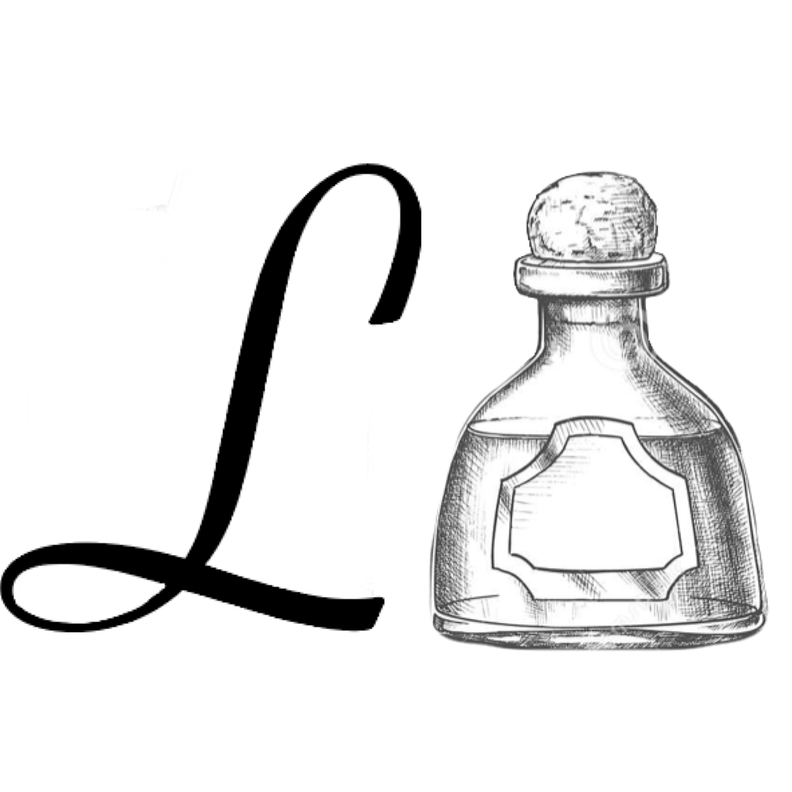

## **Hello & Welcome,**

To Letters on Liquors, the blog that looks into typography on alcoholic beverages.

My name is Lily and I’m a second year university student studying Journalism, Media and Publishing at Oxford Brookes University. This blog has been created as part of my coursework for my module on Typographic Design.

You may think as a University Student how am I to have much knowledge on alcohol that isn't tesco’s own brand, well I have been fortunate enough to have been born into a family with a love for the “finer” alcohol in life!

Having grown up observing all the exceptional alcoholic beverages my parents were drinking, and at sixteen getting a sip (if I was so lucky) with my dinner. I now at 20 years of age feel I know more than the average 20 year old when it comes to alcoholic drinks. My end goal for this blog is to create a space in which people can learn and look into typography on alcoholic beverages at greater dephth.

#### Imagery

*Logo*\
\
When creating my logo I chose to keep it simple,the “L” on the left of the bottle stands for letters the bottle on the right signifies liquor which are put together to make Letters On Liquors. When attempting to create a logo for my blog I realised letters on liquors had the initials LOL, and as I'm sure you've already realised this didn't reflect my blog so I had to abolish the O. The font I have selected is written in the font Savoye LET which in a script typeface, this undoubtedly makes my L stand out. Savoye was created in 1992 by Alan Meeks. I believe this font to be perfectly suited to my blog due to the fact that it looks as though it has been hand written which makes it pretty and elegant, matching the bottles I will be discussing in this blog. As my logo is already very simple I have made a decision to keep both my logo and favicon the same.

*Hope You Enjoy!*