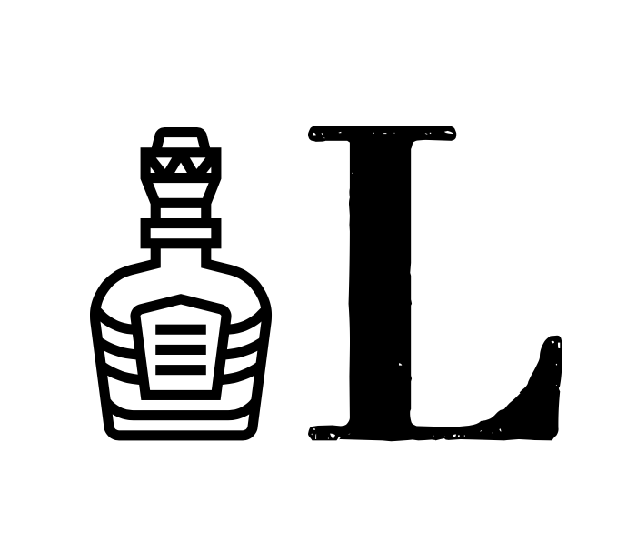
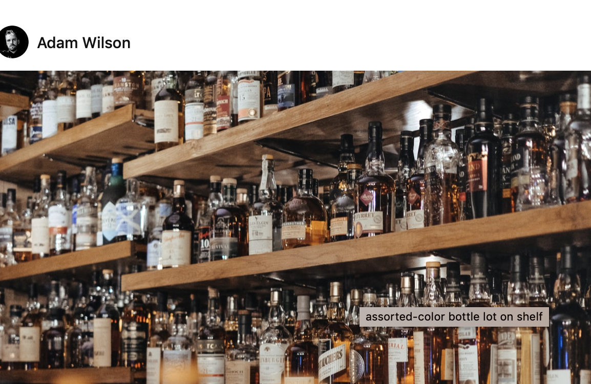

## **Hello & Welcome,**

To Letters on Liquors, the blog that looks into typography on alcoholic beverages.

My name is Lily and I’m a second year university student studying Journalism, Media and Publishing at Oxford Brookes University. This blog has been created as part of my coursework for my module on Typographic Design.

You may think as a University Student how am I to have much knowledge on alcohol that isn't tesco’s own brand, well I have been fortunate enough to have been born into a family with a love for the “finer” alcohol in life!

Having grown up observing all the exceptional alcoholic beverages my parents were drinking, and at sixteen getting a sip (if I was so lucky) with my dinner. I now at 20 years of age feel I know more than the average 20 year old when it comes to alcoholic drinks. This being said the superiority of my knowledge is in the design of the bottles the alcohol arrives in, as I've seen a few in my time.

#### Imagery

*Logo*\
\
When creating my logo I chose to keep it simple, the little bottle on the left signifies liquor and the “L” next to the bottle reflects letters which are put together to make Letters On Liquors. Yes, I am aware that the idealists out there would recognize the logo spells this backwards.. but the bottle looks more aesthetically pleasing on the left hand side of the L, so you will have to simply put up with it. When attempting to create a logo for my blog I realised my initials spell LOL, and as I'm sure you've already realised this didn't reflect my blog so I had to abolish the O. The font I have selected is written in the typeface Didot which is a modern typeface with very thin serifs and an extreme contrast. The font itself is Didot bold, this undoubtedly makes my L stand out. Didot is heavily associated with magazine brands such as Vogue. Though my blog is not a magazine I wanted to keep the blog classy thus making Didot the perfect lettering. As my logo is already very simple I have made a decision to keep both my logo and favicon the same.

*Banner*

For my banner image I have taken advantage of [unsplash](https://www.google.com/search?q=unsplashed&rlz=1C5CHFA_enGB868GB872&oq=unsplash&aqs=chrome.0.69i59j69i57j0l3j69i60l3.2806j0j7&sourceid=chrome&ie=UTF-8) a website in which you can download high quality photographs for free, my particular image was taken by [Adam Wilson](https://unsplash.com/@fourcolourblack). I selected this as I feel it is perfectly suited to my blog, and helps in keeping the brand and blog alike.

*Hope You Enjoy!*